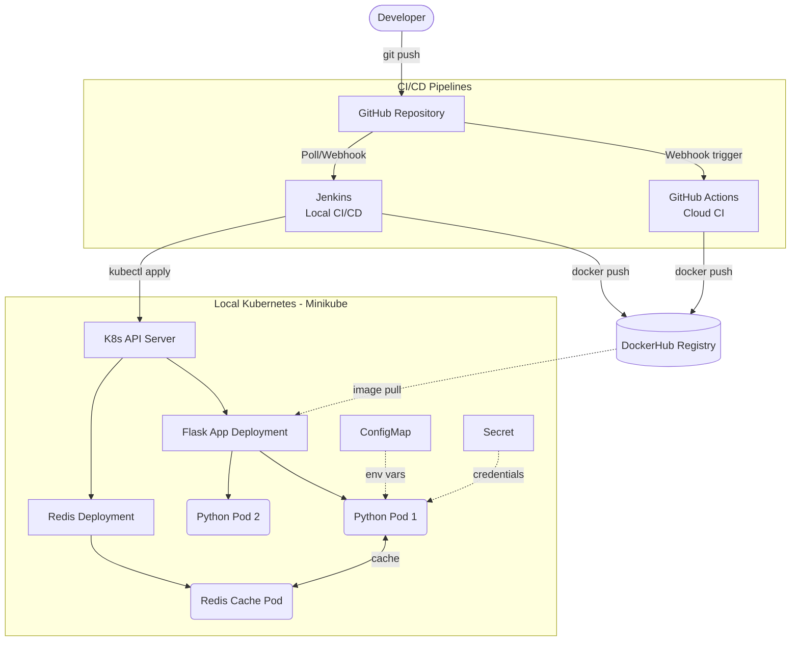

# 🌐 Network Node Health Monitor

A cloud-native REST API built with Python (Flask) and Redis that monitors system health metrics — inspired by real-world network node monitoring from telecom operations. Demonstrates production-grade DevOps practices including multi-stage containerization, Kubernetes orchestration, and dual CI/CD pipeline automation.

## 🏗️ System Architecture



## 📋 Prerequisites
* Python 3.11+
* Docker + Docker Compose
* Minikube + `kubectl`
* Jenkins (Running as a local Docker container)

## 💻 Tech Stack
* **Application:** Python (Flask), Redis (Caching)
* **Containerization:** Docker (Multi-stage builds)
* **Orchestration:** Kubernetes (Minikube, Deployments, Services, ConfigMaps, Secrets)
* **CI/CD (Local):** Jenkins (Pipeline as Code, Docker-in-Docker)
* **CI/CD (Cloud):** GitHub Actions

## 🔌 API Endpoints

| Endpoint | Method | Description |
|----------|--------|-------------|
| `/` | GET | Welcome message and available endpoints. |
| `/health` | GET | System health metrics (disk, memory) and cache status. |
| `/status` | GET | Application version and uptime monitoring. |

## 📊 Sample Response
```json
{
  "app": "Network Health Monitor",
  "cache": "miss",
  "disk": {
    "available": "45G",
    "total": "59G",
    "usage_percent": "24%",
    "used": "11G"
  },
  "environment": "production",
  "memory": {
    "free": "2.1G",
    "total": "7.7G",
    "used": "4.2G"
  },
  "status": "healthy",
  "timestamp": "2026-03-30T14:23:45.123456",
  "version": "1.0.0"
}
```

## 🚀 Dual CI/CD Pipeline Workflows

This project implements two separate CI/CD strategies to demonstrate both local enterprise and cloud-native automation.

### Pipeline A: Jenkins (Local Enterprise Deployment)
1. Developer pushes code to the repository.
2. Jenkins pulls code, provisions a virtual environment, and runs `pytest`.
3. Jenkins builds the Docker image, tagged with the internal `BUILD_NUMBER`.
4. Jenkins securely authenticates and pushes the image to DockerHub.
5. Jenkins executes `kubectl set image` to trigger a rolling update on the local Minikube cluster.

### Pipeline B: GitHub Actions (Cloud-Native CI)
1. Code push to `main` branch triggers the cloud runner (`ubuntu-latest`).
2. Code is checked out and Python 3.11 is provisioned.
3. Tests are executed via `pytest`.
4. Multi-stage Docker image is built and tagged securely with the `github.sha` (for rollback traceability) and `latest`.
5. Images are pushed to DockerHub, ready for a production cloud pull.
* **Note:** Direct K8s deployment from GitHub Actions requires a cloud cluster (e.g., AWS EKS) with a kubeconfig stored as a GitHub Secret. Local Minikube deployment for this project is handled natively by Jenkins.

## ☸️ Kubernetes Resources Handled
* **Deployments:** Managing replicas for both the Python App and Redis.
* **Services:** ClusterIP (internal routing) and NodePort (external access).
* **Configuration:** ConfigMaps (environment settings) and Secrets (sensitive tokens).
* **Resilience:** Liveness/Readiness probes and graceful fallback logic if Redis fails.

## 🛠️ Running Locally

### Option 1: Docker Compose (Quickstart)
```bash
docker compose up -d
curl http://localhost:5000/health
```

### Option 2: Kubernetes (Minikube)
```bash
minikube start --driver=docker
kubectl apply -f k8s/configmap.yaml
kubectl apply -f k8s/secret.yaml
kubectl apply -f k8s/redis.yaml
kubectl apply -f k8s/deployment.yaml
kubectl apply -f k8s/service.yaml
minikube service health-monitor-service
```

### Option 3: Raw Python
```bash
python3 -m venv venv
source venv/bin/activate
pip install -r requirements.txt
python app/main.py
```