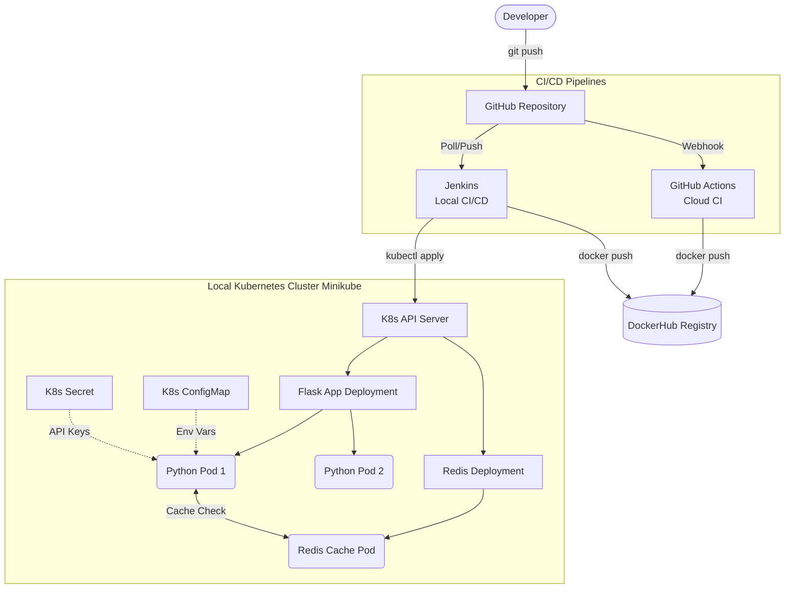

# 🌐 Network Node Health Monitor

A robust REST API built with Python (Flask) and Redis that monitors system health metrics. This project demonstrates a production-grade, end-to-end CI/CD pipeline featuring multi-stage Docker containerization, Kubernetes orchestration, and dual-pipeline automation (Jenkins & GitHub Actions).

## 🏗️ System Architecture



## 💻 Tech Stack
* **Application:** Python (Flask), Redis (Caching)
* **Containerization:** Docker (Multi-stage builds)
* **Orchestration:** Kubernetes (Minikube, Deployments, Services, ConfigMaps, Secrets)
* **CI/CD (Local):** Jenkins (Pipeline as Code, Docker-in-Docker)
* **CI/CD (Cloud):** GitHub Actions

## 🔌 API Endpoints

| Endpoint | Method | Description |
|----------|--------|-------------|
| `/` | GET | Welcome message and available endpoints. |
| `/health` | GET | System health metrics (disk, memory) and cache status. |
| `/status` | GET | Application version and uptime monitoring. |

## 🚀 Dual CI/CD Pipeline Workflows

This project implements two separate CI/CD strategies to demonstrate both local enterprise and cloud-native automation.

### Pipeline A: Jenkins (Local Enterprise Deployment)
1. Developer pushes code to the repository.
2. Jenkins pulls code, provisions a virtual environment, and runs `pytest`.
3. Jenkins builds the Docker image, tagged with the internal `BUILD_NUMBER`.
4. Jenkins securely authenticates and pushes the image to DockerHub.
5. Jenkins executes `kubectl set image` to trigger a rolling update on the local Minikube cluster.

### Pipeline B: GitHub Actions (Cloud-Native CI)
1. Code push to `main` branch triggers the cloud runner (`ubuntu-latest`).
2. Code is checked out and Python 3.11 is provisioned.
3. Tests are executed via `pytest`.
4. Multi-stage Docker image is built and tagged securely with the `github.sha` (for rollback traceability) and `latest`.
5. Images are pushed to DockerHub, ready for a production cloud pull (e.g., AWS EKS).

## ☸️ Kubernetes Resources Handled
* **Deployments:** Managing replicas for both the Python App and Redis.
* **Services:** ClusterIP (internal routing) and NodePort (external access).
* **Configuration:** ConfigMaps (environment settings) and Secrets (sensitive tokens).
* **Resilience:** Liveness/Readiness probes and graceful fallback logic if Redis fails.

## 🛠️ Running Locally

**Option 1: Raw Python**
```bash
pip install -r requirements.txt
python app/main.py
```

**Option 2: Docker Compose (Recommended)**
```bash
docker compose up -d
curl http://localhost:5000/health
```